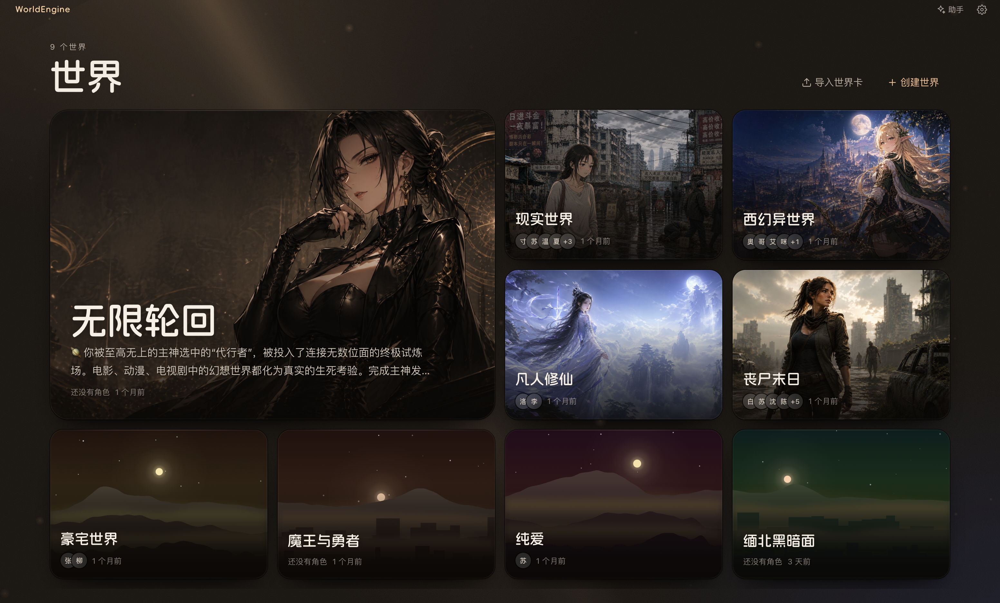

# WorldEngine

**本地优先的 AI 角色扮演与长篇创作引擎**

在一个持续演化的世界中管理角色、玩家身份、规则、状态和记忆，并通过对话或写作推进故事。

[](LICENSE)
[](https://github.com/n0ctx/WorldEngine/releases)
[](https://github.com/n0ctx/WorldEngine/stargazers)
[](https://nodejs.org/)



## 适合做什么

WorldEngine 面向需要长期维护设定和剧情连续性的创作者。它不是一次性聊天壳，而是把故事运行所需的信息分层保存：

- **世界**：世界观、规则条目、世界状态和模型参数。
- **玩家身份（Persona）**：同一世界中可切换的玩家姓名、人设与状态。
- **角色**：角色卡、开场白、后置指令和独立状态。
- **故事线**：对话与写作会话、消息历史、章节和状态快照。
- **记忆**：摘要召回、原文展开、长期记忆、表格记忆和日记，可按需启用。

适用于互动小说、角色扮演、TRPG 辅助、世界观实验和长篇创意写作。

## 当前能力

### 对话与写作

- **Chat**：围绕单个角色进行对话，支持多会话、续写、重新生成、编辑消息和状态侧栏。
- **Writing**：按章节组织长篇正文，可让多个场景角色共同参与，并管理附近角色及其状态。
- 对话和写作拥有独立的模型、全局提示词、正则规则、自定义 CSS 与功能开关。
- 流式生成过程中可以停止；页面重载后会尝试恢复仍在运行的任务。

### 规则与状态

- 规则条目支持常驻、关键词、语义判断和状态条件四类触发方式。
- 世界、角色、玩家身份分别维护状态字段和状态值。
- 字段支持文本、数值、布尔、枚举、列表、日期时间和表格等类型。
- 会话保存自己的状态快照；删除或重新生成消息时，相关状态和记忆可随故事线一起回退。

### 记忆系统

- 对历史轮次生成摘要，并通过 Embedding 召回与当前内容相关的片段。
- 可让辅助模型判断是否需要展开摘要对应的原文。
- 可选长期记忆、按日记载和四类结构化表格记忆：关系、物品、地点、势力。
- 写作模式可以按当前剧情召回已保存角色，减少长篇推进中的人物遗漏。

### 写卡助手

写卡助手是独立于剧情模型的配置代理，可以协助创建或修改世界、角色、玩家身份、规则、状态字段和全局配置。涉及写入的操作会先展示计划或提案，由用户确认后执行。

### 个性化与运维

- 内置可切换主题，并支持自定义 CSS。
- 对话和写作可分别配置显示正则规则。
- 支持代理地址、模型连通性测试、Token 用量展示和 Provider 安全信号查看。
- 支持世界、角色、玩家卡、模式设置和迁移包的导入导出。

## 数据与隐私

WorldEngine 的数据库、配置、头像、记忆和日志保存在本机：

- 源码模式默认使用仓库下的 `data/`。
- 桌面版使用操作系统分配给 WorldEngine 的应用数据目录。
- API Key 保存在本地配置中，不会写入世界卡、设置导出文件或全量迁移包。

“本地优先”不等于“所有推理都在本地”。选择云端 Provider 时，生成所需的提示词和上下文会发送给对应服务商；如需完全本地推理，请使用 Ollama、LM Studio 或 llama.cpp，并自行确认所用模型和 Embedding 服务的运行位置。

迁移包用于备份设定与配置，不包含对话或写作会话历史。如需完整备份，请在退出应用后复制整个应用数据目录。导入设置和迁移包属于覆盖性操作，请先确认备份。

## 安装与启动

### 桌面版

在 [Releases](https://github.com/n0ctx/WorldEngine/releases) 下载对应安装包。当前打包目标包括：

- macOS：Apple Silicon、Intel
- Windows：x64

安装后打开设置，选择 Provider，填写 API Key 或本地模型地址并测试连接。

### 从源码运行

要求：

- Node.js `20.19+` 或 `22.12+`
- npm

```bash
git clone https://github.com/n0ctx/WorldEngine.git
cd WorldEngine

# 根依赖包含前端和写卡助手；后端单独安装
npm install
npm install --prefix backend

# 同时启动前端和后端
npm run dev
```

启动后访问 <http://localhost:5173>。后端默认监听 `127.0.0.1:3000`。

也可以直接运行仓库根目录的启动脚本，它会同步依赖并打开浏览器：

- macOS：双击 `WorldEngine.command`；首次运行前可能需要执行 `chmod +x WorldEngine.command`
- Windows：双击 `WorldEngine.bat`

## 模型支持

主模型和辅助模型可分别配置。界面内置以下 Provider：

- 云端：OpenAI、Anthropic、Google Gemini、OpenRouter、DeepSeek、Grok、SiliconFlow、Qwen、Xiaomi、GLM、Kimi、MiniMax，以及对应的 Coding Plan 接口。
- 本地：Ollama、LM Studio、llama.cpp。
- Embedding：OpenAI、OpenAI Compatible、Ollama，也可以关闭。

远程自定义地址必须使用 HTTPS，且不能指向本机或私有网络；本地 Provider 只接受本机地址。这一限制用于避免把凭据或请求意外发送到不可信目标。

## 导入导出

| 扩展名 | 内容 |
|---|---|
| `.wechar.json` | 单个角色及其状态字段 |
| `.wepersona.json` | 单个玩家身份及其状态字段 |
| `.weworld.json` | 世界、角色、玩家身份、规则、状态字段和默认值 |
| `.weglobal.json` | 当前对话或写作模式的提示词、CSS、正则和相关配置 |
| `.wemigration.json` | 两种模式的全局设置与全部世界卡，用于配置和设定迁移 |

所有格式都是 JSON。导出文件不包含 API Key；当前也不导出对话或写作会话历史。

## 项目结构

```text
frontend/    React 前端、页面与交互状态
backend/     Express API、SQLite、模型调用、状态与记忆流程
assistant/   写卡助手客户端、服务端和工具
desktop/     Electron 桌面封装与打包配置
themes/      可切换主题包
shared/      前后端与助手共享协议
scripts/     质量守卫和仓库维护脚本
data/        源码模式的本地数据目录
```

主要技术栈：React 19、Vite 8、Zustand、Express 5、SQLite（better-sqlite3）、Electron。

## 开发与验证

```bash
# 完整检查：lint、源码守卫、各模块测试
npm run check

# 只运行八类源码守卫
npm run check:guards

# 分模块测试
npm run test:frontend
npm run test:backend
npm run test:assistant

# 端到端测试
npm run test:e2e

# 构建前端
npm run build --prefix frontend

# 构建桌面安装包
npm run desktop:install
npm run desktop:dist
```

源码守卫采用基线棘轮：历史问题可以逐步减少，但新代码不能新增或扩大体量、复杂度、重复、死代码、测试形态、运行形态、循环依赖和架构边界问题。

## 项目状态

WorldEngine 仍在快速迭代，数据结构、配置和交互可能继续变化。使用开发版本时请定期导出迁移包，并在升级后检查模型配置与关键世界数据。

## 社区与许可

- QQ 群：**964968606**
- License：[MIT](LICENSE)
